# Fast Reinforcement Learning
This repo is not affiliated with Jeremy Howard or his course which can be found here: [here](https://www.fast.ai/about/)
We will be using components from the Fastai library however for building and training our reinforcement learning (RL) 
agents.

As a note, here is a run down of existing RL frameworks:
- [Intel Coach](https://github.com/NervanaSystems/coach) 
- [Tensor Force](https://github.com/tensorforce/tensorforce)
- [OpenAI Baselines](https://github.com/openai/baselines)
- [Tensorflow Agents](https://github.com/tensorflow/agents)
- [KerasRL](https://github.com/keras-rl/keras-rl)

However there are also frameworks in PyTorch most notably Facebook's Horizon:
- [Horizon](https://github.com/facebookresearch/Horizon)
- [DeepRL](https://github.com/ShangtongZhang/DeepRL)

Our motivation is that existing frameworks commonly use tensorflow, which nothing against tensorflow, but we have 
accomplished more in shorter periods of time using PyTorch. 

Fastai for computer vision and tabular learning has been amazing. One would wish that this would be the same for RL. 
The purpose of this repo is to have a framework that is as easy as possible to start, but also designed for testing
new agents. 

# Table of Contents
1. [Installation](#installation)
2. [Alpha TODO](#alpha-todo)
3. [Code](#code)
5. [Versioning](#versioning)
6. [Contributing](#contributing)
7. [Style](#style)


## Installation
Very soon we would like to add some form of scripting to install some complicated dependencies. We have 2 steps:

**1.a FastAI**
[Install Fastai](https://github.com/fastai/fastai/blob/master/README.md#installation)
or if you are Anaconda (which is a good idea to use Anaconda) you can do: \
`conda install -c pytorch -c fastai fastai`


**1.b Optional / Extra Envs**
OpenAI all gyms: \
`pip install gym[all]`

Mazes: \
`git clone https://github.com/MattChanTK/gym-maze.git` \
`cd gym-maze` \
`python setup.py install`


**2 Actual Repo** \
`git clone https://github.com/josiahls/fast-reinforcement-learning.git` \
`cd fast-reinforcement-learning` \
`python setup.py install`

## Alpha TODO
At the moment these are the things we personally urgently need, and then the nice things that will make this repo
something akin to valuable. These are listed in kind of the order we are planning on executing them.

At present, we are in the Alpha stages of agents not being fully tested / debugged. The final step (before 1.0.0) will 
be doing an evaluation of the DQN and DDPG agent implementations and verifying each performs the best it can at 
known environments. Prior to 1.0.0, new changes might break previous code versions, and models are not guaranteed to be
working at their best. Post 1.0.0 will be more formal feature development with CI, unit testing, etc. 

**Critical**
- [X] 0.0.0 MDPDataBunch: Finished to the point of being useful. Please reference: `tests/test_Envs`
Example:
```python
from fast_rl.core.Envs import Envs
from fast_rl.core.MarkovDecisionProcess import MDPDataBunch

# At present will try to load OpenAI, box2d, pybullet, atari, maze.
# note "get_all_latest_envs" has a key inclusion and exclusion so if you don't have some of these envs installed, 
# you can avoid this here. Certain envs just flat out do not work / are unusual. You are welcome to see how to get them
# working.
for env in Envs.get_all_latest_envs():
    max_steps = 50  # Limit the number of per episode iterations for now.
    print(f'Testing {env}')
    mdp_databunch = MDPDataBunch.from_env(env, max_steps=max_steps, num_workers=0)
    if mdp_databunch is None:
        print(f'Env {env} is probably Mujoco... Add imports if you want and try on your own. Don\'t like '
              f'proprietary engines like this. If you have any issues, feel free to make a PR!')
    else:
        epochs = 1 # N episodes to run
        for epoch in range(epochs):
            for state in mdp_databunch.train_dl:
                # Instead of random action, you would have your agent here
                mdp_databunch.train_ds.actions = mdp_databunch.train_ds.get_random_action()
    
            for state in mdp_databunch.valid_dl:
                # Instead of random action, you would have your agent here and have exploration to 0
                mdp_databunch.valid_ds.actions = mdp_databunch.valid_ds.get_random_action()
```
- [X] 0.1.0 DQN Agent: Reference `tests/test_Learner/test_basic_dqn_model_maze`. We use Learner callbacks for 
handling the different fit behaviors. 

Testable code:
```python
from fast_rl.agents.DQN import DQN
from fast_rl.core.Learner import AgentLearner
from fast_rl.core.MarkovDecisionProcess import MDPDataBunch

data = MDPDataBunch.from_env('maze-random-5x5-v0', render='human')
model = DQN(data)
learn = AgentLearner(data, model)
learn.fit(450)
``` 
Result:

| 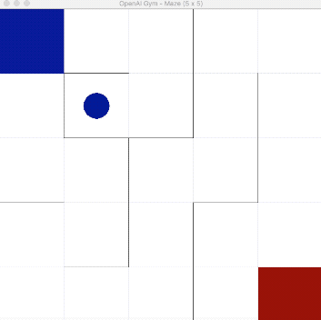 |
|:---:|
| *Fig 1: We are now able to train an agent using some Fastai API* |


We believe that the agent explodes after the first episode. Not to worry! We will make a RL interpreter to see whats 
going on!

- [X] 0.2.0 AgentInterpretation: First method will be heatmapping the image / state space of the 
environment with the expected rewards for super important debugging. In the code above, we are testing with a maze for a
good reason. Heatmapping rewards over a maze is pretty easy as opposed to other environments.

Usage example:
```python
from fast_rl.agents.DQN import DQN
from fast_rl.core.Interpreter import AgentInterpretationAlpha
from fast_rl.core.Learner import AgentLearner
from fast_rl.core.MarkovDecisionProcess import MDPDataBunch

data = MDPDataBunch.from_env('maze-random-5x5-v0', render='human')
model = DQN(data)
learn = AgentLearner(data, model)
learn.fit(10)
interp = AgentInterpretationAlpha(learn)
interp.plot_heatmapped_episode(5)
```

| 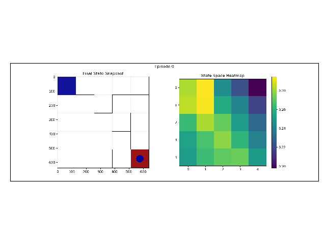 |
|:---:|
| *Fig 2: Cumulative rewards calculated over states during episode 0* |
| 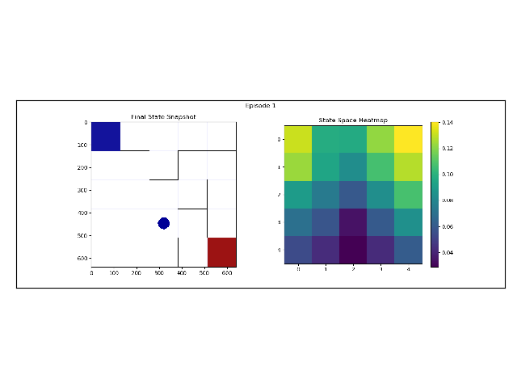 |
| *Fig 3: Episode 7* |
| 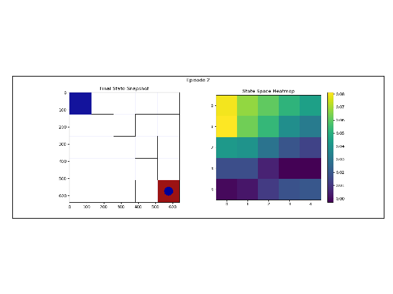 |
| *Fig 4: Unimportant parts are excluded via reward penalization* |
| 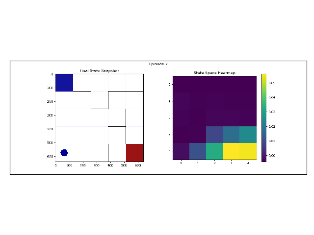 |
| *Fig 5: Finally, state space is fully explored, and the highest rewards are near the goal state* |

If we change:
```python
interp = AgentInterpretationAlpha(learn)
interp.plot_heatmapped_episode(epoch)
```
to:
```python
interp = AgentInterpretationAlpha(learn)
interp.plot_episode(epoch)
```
We can get the following plots for specific episodes:

| 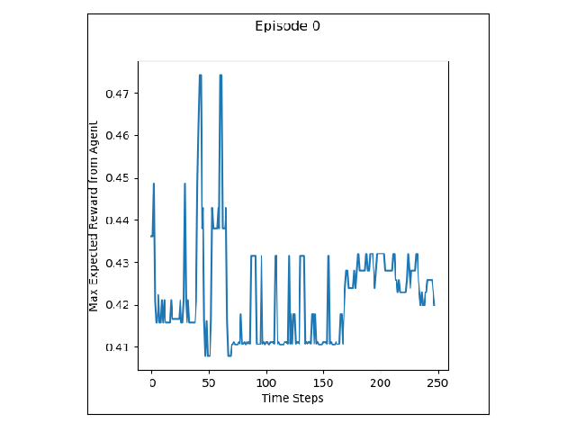 |
|:----:|
| *Fig 6: Rewards estimated by the agent during episode 0* |

As determined by our AgentInterpretation object, we need to either debug or improve our agent. 
We will do this in parallel with creating our Learner fit function. 

- [X] 0.3.0 Add DQNs: DQN, Dueling DQN, Double DQN, Fixed Target DQN, DDDQN.
- [X] 0.4.0 Learner Basic: We need to convert this into a suitable object. Will be similar to the basic fasai learner
hopefully. Possibly as add prioritize replay?
    - Added PER.
- [X] 0.5.0 DDPG Agent: We need to have at least one agent able to perform continuous environment execution. As a note, we 
could give discrete agents the ability to operate in a continuous domain via binning. 
    - [X] 0.5.0 DDPG added. let us move
    - [X] 0.5.0 The DDPG paper contains a visualization for Q learning might prove useful. Add to interpreter.

| 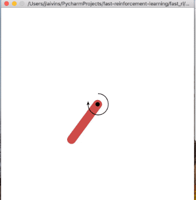 |
|:----:|
| *Fig 7: DDPG trains stably now..* |


Added q value interpretation per explanation by Lillicrap et al., 2016. Currently both models (DQN and DDPG) have 
unstable q value approximations. Below is an example from DQN.
```python
interp = AgentInterpretationAlpha(learn, ds_type=DatasetType.Train)
interp.plot_q_density(epoch)
```
Can be referenced in `fast_rl/tests/test_interpretation` for usage. A good agent will have mostly a diagonal line, 
a failing one will look globular or horizontal.

| 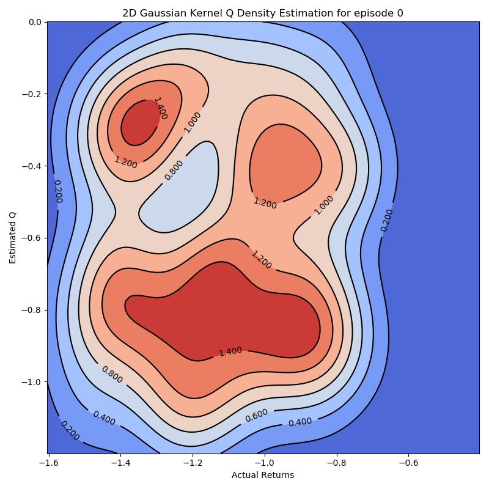 |
|:----:|
| *Fig 8: Initial Q Value Estimate. Seems globular which is expected for an initial model.* |

| 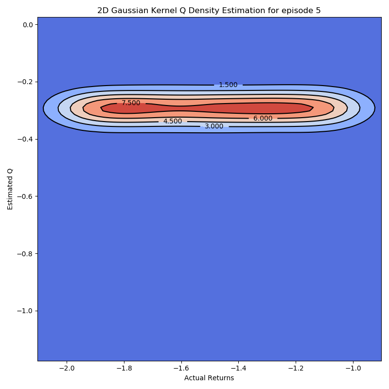 |
|:----:|
| *Fig 9: Seems like the DQN is not learning...* |

| 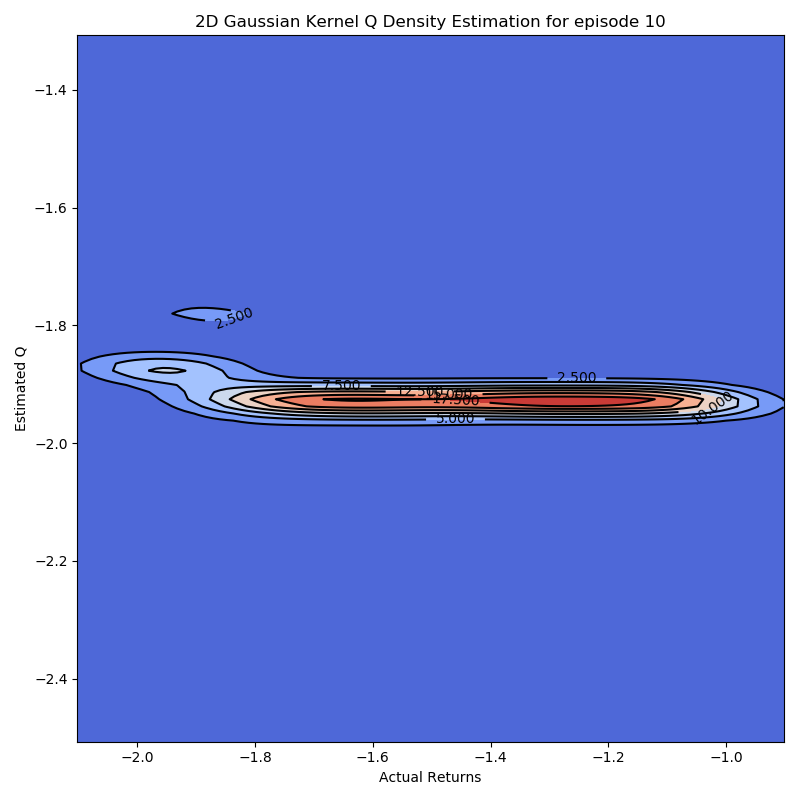 |
|:----:|
| *Fig 10: Alarming later epoch results. It seems that the DQN converges to predicting a single Q value.* |

- [X] 0.6.0 Single Global fit function like Fastai's. Think about the missing batch step. Noted some of the changes to 
the existing the Fastai 

| 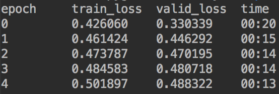 |
|:----:|
| *Fig 11: Resulting output of a typical fit function using ref code below.* |

```python
from fast_rl.agents.DQN import DuelingDQN
from fast_rl.core.Learner import AgentLearner
from fast_rl.core.MarkovDecisionProcess import MDPDataBunch


data = MDPDataBunch.from_env('maze-random-5x5-v0', render='human', max_steps=1000)
model = DuelingDQN(data)
# model = DQN(data)
learn = AgentLearner(data, model)

learn.fit(5)
```


- [ ] **Working On** 0.7.0 Full test suite using multi-processing. Connect to CI.
- [ ] 0.8.0 Comprehensive model eval **debug/verify**. Each model should succeed at at least a few known environments. 
- [ ] 0.9.0 Notebook demonstrations of basic model usage
- [ ] **1.0.0** Base version is completed with working model visualizations proving performance / expected failure. At 
this point, all models should have guaranteed environments they should succeed in. 
- [ ] 1.2.0 Add PyBullet Fetch Environments
    - [ ] 1.2.0 Not part of this repo, however the envs need to subclass the OpenAI `gym.GoalEnv`
    - [ ] 1.2.0 Add HER


## Code 
Some of the key take aways is Fastai's use of callbacks. Not only do callbacks allow for logging, but in fact adding a
callback to a generic fit function can change its behavior drastically. My goal is to have a library that is as easy
as possible to run on a server or on one's own computer. We are also interested in this being easy to extend. 

We have a few assumptions that the code / support algorithms I believe should adhere to:
- Environments should be pickle-able, and serializable. They should be able to shut down and start up multiple times
during run time.
- Agents should not need more information than images or state values for an environment per step. This means that 
environments should not be expected to allow output of contact points, sub-goals, or STRIPS style logical outputs. 

Rational:
- Shutdown / Startup: Some environments (pybullet) have the issue of shutting down and starting different environments.
Luckily, we have a fork of pybullet, so these modifications will be forced. 
- Pickling: Being able to encapsulate an environment as a `.pkl` can be important for saving it and all the information
it generated.
- Serializable: If we want to do parallel processing, environments need to be serializable to transport them between 
those processes.

Some extra assumptions:
- Environments can easier be goal-less, or have a single goal in which OpenAI defines as `Env` and `GoalEnv`. 

These assumptions are necessary for us to implement other envs from other repos. We do not want to be tied to just
OpenAI gyms. 

## Versioning
At present the repo is in alpha stages being. We plan to move this from alpha to a pseudo beta / working versions. 
Regardless of version, we will follow Python style versioning

_Alpha Versions_:  #.#.# e.g. 0.1.0. Alpha will never go above 0.99.99, at that point it will be full version 1.0.0.
                   A key point is during alpha, coding will be quick and dirty with no promise of proper deprecation.

_Beta / Full Versions_: These will be greater than 1.0.0. We follow the Python method of versions:
                        **[Breaking Changes]**.**[Backward Compatible Features]**.**[Bug Fixes]**. These will be feature
                        additions such new functions, tools, models, env support. Also proper deprecation will be used.
                        
_Pip update frequency_: We have a pip repository, however we do not plan to update it as frequently at the moment. 
                        However, the current frequency will be during Beta / Full Version updates, we might every 0.5.0
                        versions update pip.

## Contributing
Follow the templates we have on github. Make a branch either from master or the most recent version branch.
We recommend squashing commits / keep pointless ones to a minimum.


## Style
Fastai does not follow closely with [google python style guide](https://github.com/google/styleguide/blob/gh-pages/pyguide.md#3164-guidelines-derived-from-guidos-recommendations),
however in this repo we will use this guide.  
Some exceptions however (typically found in Fastai):
- "PEP 8 Multiple statements per line violation" is allowed in the case of if statements as long as they are still 
within the column limit.
